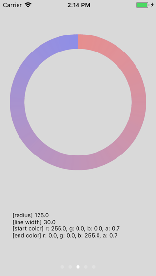

# Gradient Circular

Customizable gradient circular Image and ImageView library in Swift.

## Requirements
- Swift 4.2
- iOS 9.0 or later

## Screen Shots

    


## Installation

###Carthage

* Cartfile

```Cartfile
github "keygx/GradientCircular"
```
or

```Cartfile
github "keygx/GradientCircular" "branch-name"
```
or

```Cartfile
github "keygx/GradientCircular" "tag"
```

* install

```
$ carthage update
```

To integrate "GradientCircular.framework" into your Xcode project


## Usage

* UIImageView

```swift
let style = GradientCircularConf.Style(frame: rect,
                                       lineWidth: lineWidth,
                                       gradient: (startColor, endColor))
let arcImageView = GradientCircular.drawImageView(style: style)

view.addSubview(arcImageView)
```

* UIImage

```swift
let style = GradientCircularConf.Style(frame: rect,
                                       lineWidth: lineWidth,
                                       gradient: (startColor, endColor))
let arcImage = GradientCircular.drawImage(style: style)

imageView.image = arcImage
```


## License

Gradient Circular is released under the MIT license. See LICENSE for details.

## Author

Yukihiko Kagiyama (keygx) <https://twitter.com/keygx>

